<p align="center">
  
  
  
  
  
  
</p>

<p align="center">
  
</p>

# 📊 Walmart Sales Analytics — Python ETL + PostgreSQL Analysis

This project demonstrates a complete end-to-end data analytics workflow using:

- **Kaggle API** for dataset retrieval  
- **Python & Pandas** for data cleaning, preprocessing, and feature engineering  
- **PostgreSQL (pgAdmin)** for analytical SQL  
- **17 real-world business questions** answered using SQL  

The goal is to simulate a retail analytics pipeline: cleaning operational data, enriching it, loading it into a database, and performing SQL-driven insights.

---

## 📥 1. Dataset Source

Dataset was downloaded directly into Jupyter Notebook via:

```bash
!kaggle datasets download -d najir0123/walmart-10k-sales-datasets
```

---

## 📊 2. Dataset Overview

The **Walmart Sales Dataset** contains transactional retail data collected from multiple Walmart branches across different cities in the United States. Each row represents a customer transaction, including details about the product category, pricing, payment method, customer rating, and time of purchase.

---

## 🏷️ **Column Description**

| Column | Description |
|--------|-------------|
| **invoice_id** | Unique ID for each transaction |
| **branch** | Walmart branch code (e.g., WALM003) |
| **city** | City where the branch is located |
| **category** | Product category sold |
| **unit_price** | Price per unit of the product |
| **quantity** | Number of units purchased |
| **date** | Transaction date |
| **time** | Transaction timestamp |
| **payment_method** | Payment mode used (Cash, Credit card, Ewallet) |
| **rating** | Customer satisfaction rating (1–10) |
| **profit_margin** | Profit margin percentage for the product category |

---

## 🧼 3. Data Cleaning & Preprocessing (Python)

Key cleaning operations performed:

- Corrected data types
- Removed duplicates
- Standardized column formats
- Cleaned `unit_price` column
- Converted `date` and `time` columns to proper datetime formats
- Handled missing values  

---

## ✨ 4. Feature Engineering (Python)

New engineered features created to support SQL analytics:

| Column Name | Description |
|------------|-------------|
| **total_price** | `unit_price * quantity` |
| **shift** | Morning / Afternoon / Evening |
| **day_name** | Weekday extracted from `date` |
| **unit_price_diff_from_cat_avg** | Unit price deviation from category average |
| **cleaned datetime fields** | Better sorting & grouping |

The cleaned DataFrame was exported into PostgreSQL as `walmart_sales`.

---

## 🗄 5. SQL Analysis (17 Business Questions)

Each business question includes:

- The business question statement  
- The corresponding SQL query  
- A output screenshot showing a sample of the result  
- A brief business insight, included only where additional explanation adds value

> Note: The output screenshots display only the first few rows of the query results for readability.  
> If a query returns only a small number of rows, the complete output is shown.

---

# 🧠 Business Questions & SQL Queries

---

### **Q1. What payment methods are used, and how many transactions + items were sold through each method?**

```sql
SELECT payment_method,
       COUNT(*) AS transactions_count,
       SUM(quantity) AS total_items_sold
FROM walmart_sales
GROUP BY payment_method;
```

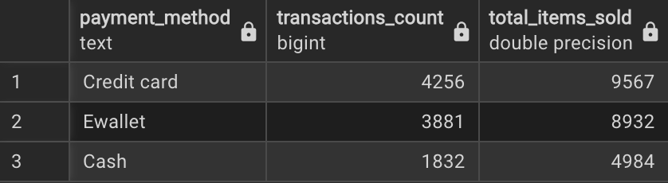

---

### **Q2. Which product category has the highest average customer rating per branch?**

```sql
SELECT branch, category, avg_rating
FROM (
    SELECT branch, category,
           ROUND(AVG(rating)::NUMERIC, 2) AS avg_rating,
           RANK() OVER (PARTITION BY branch ORDER BY AVG(rating) DESC) AS rn
    FROM walmart_sales
    GROUP BY branch, category
) t
WHERE rn = 1;
```

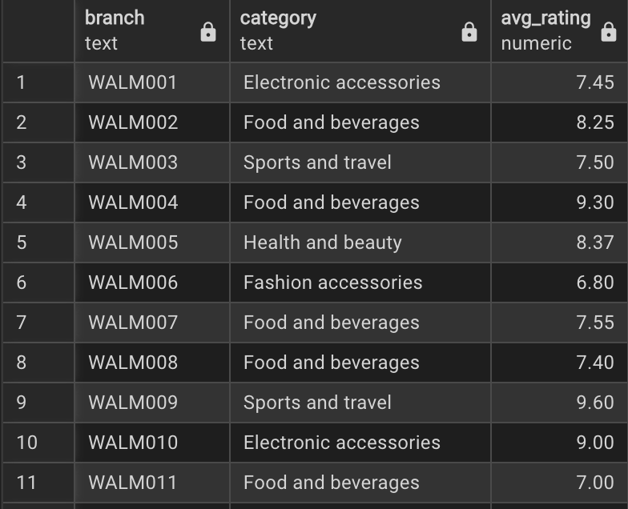

---

### **Q3. Which day of the week records the highest number of transactions for each branch?**

```sql
SELECT branch, day_name, total_transactions
FROM (
    SELECT branch, day_name,
           COUNT(*) AS total_transactions,
           RANK() OVER (PARTITION BY branch ORDER BY COUNT(*) DESC) AS rn
    FROM walmart_sales
    GROUP BY branch, day_name
) t
WHERE rn = 1;
```

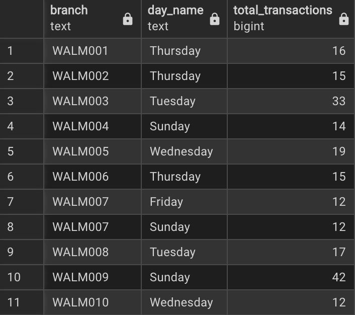

---

### **Q4. What are the average, minimum, and maximum ratings for each category within each city?**

```sql
SELECT city, category,
       ROUND(AVG(rating)::NUMERIC, 2) AS avg_rating,
       MIN(rating) AS min_rating,
       MAX(rating) AS max_rating
FROM walmart_sales
GROUP BY city, category;
```

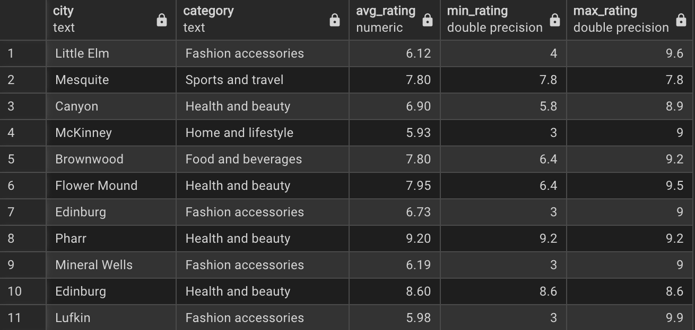

---

### **Q5. What is the total profit generated by each product category (highest to lowest)?**

```sql
SELECT category,
       ROUND(SUM(profit_margin * total_price)::NUMERIC, 2) AS total_profit
FROM walmart_sales
GROUP BY category
ORDER BY total_profit DESC;
```

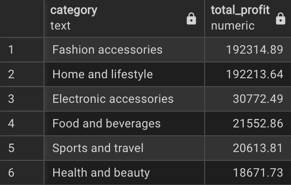

---

### **Q6. What is the most frequently used payment method in each branch?**

```sql
SELECT branch, payment_method, total_transactions
FROM (
    SELECT branch, payment_method,
           COUNT(*) AS total_transactions,
           RANK() OVER (PARTITION BY branch ORDER BY COUNT(*) DESC) AS rn
    FROM walmart_sales
    GROUP BY branch, payment_method
) t
WHERE rn = 1;
```

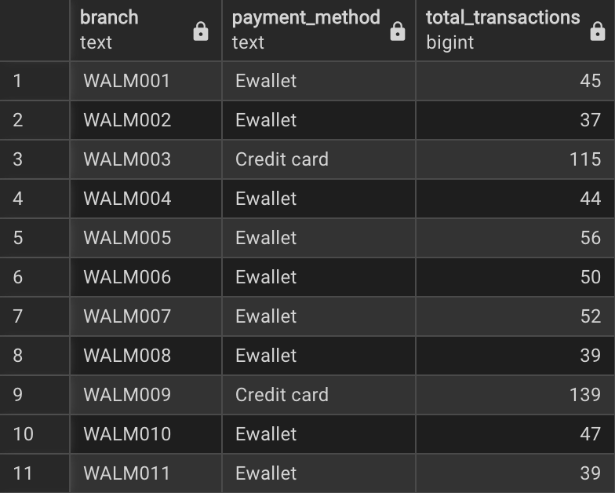

---

### **Q7. How many transactions occur in each shift across branches?**

```sql
SELECT branch, shift, COUNT(*) AS total_transactions
FROM walmart_sales
GROUP BY branch, shift
ORDER BY branch, total_transactions DESC;
```

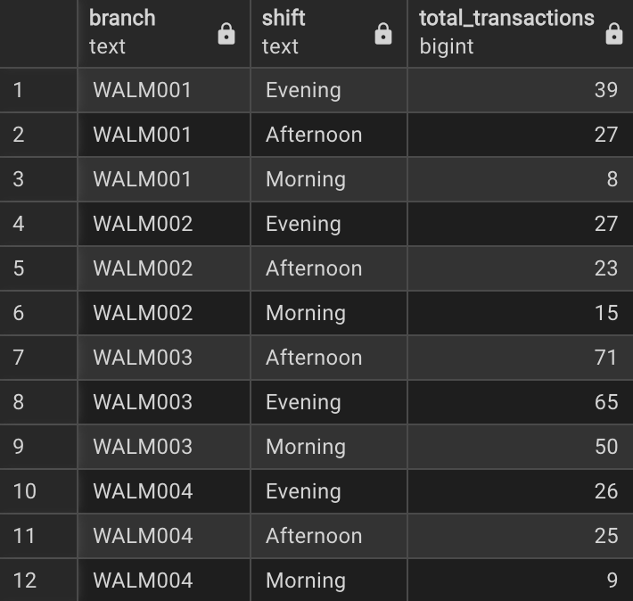

**Insight:** Provides clarity on peak shopping hours, showing that customers are more likely to shop during the evening, as many branches record a higher number of transactions in the evening shift.

---

### **Q8. Which branches show the largest YoY (2022–2023) revenue decrease?**

```sql
WITH cte AS (
    SELECT branch,
           SUM(CASE WHEN EXTRACT(YEAR FROM date)=2022 THEN total_price END) AS revenue_2022,
           SUM(CASE WHEN EXTRACT(YEAR FROM date)=2023 THEN total_price END) AS revenue_2023
    FROM walmart_sales
    GROUP BY branch
)
SELECT *, 
       ROUND(((revenue_2023 - revenue_2022) * 100.0 / revenue_2022)::NUMERIC, 2) AS YoY_percent_change
FROM cte
ORDER BY YoY_percent_change;
```

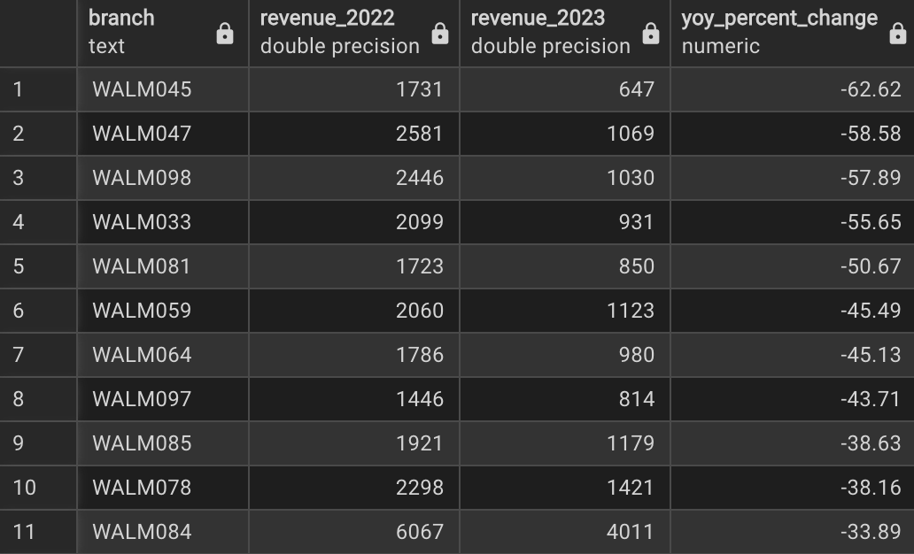

---

### **Q9. Identify transactions where unit price deviates ±2 std deviations from category mean.**

```sql
WITH cte AS (
    SELECT invoice_id, branch, category, unit_price,
           ROUND(AVG(unit_price) OVER(PARTITION BY category),2) AS avg_price,
           ROUND(STDDEV(unit_price) OVER(PARTITION BY category),2) AS std_price
    FROM walmart_sales
)
SELECT *
FROM cte
WHERE unit_price > avg_price + 2 * std_price
   OR unit_price < avg_price - 2 * std_price;
```

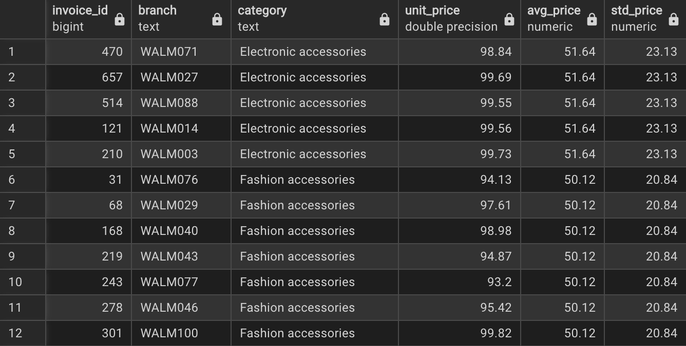

---

### **Q10. Calculate cumulative total revenue for each branch.**

```sql
SELECT branch, date, total_price,
       ROUND(SUM(total_price) OVER (PARTITION BY branch ORDER BY date)::NUMERIC, 2) AS running_revenue
FROM walmart_sales
ORDER BY branch, date;
```

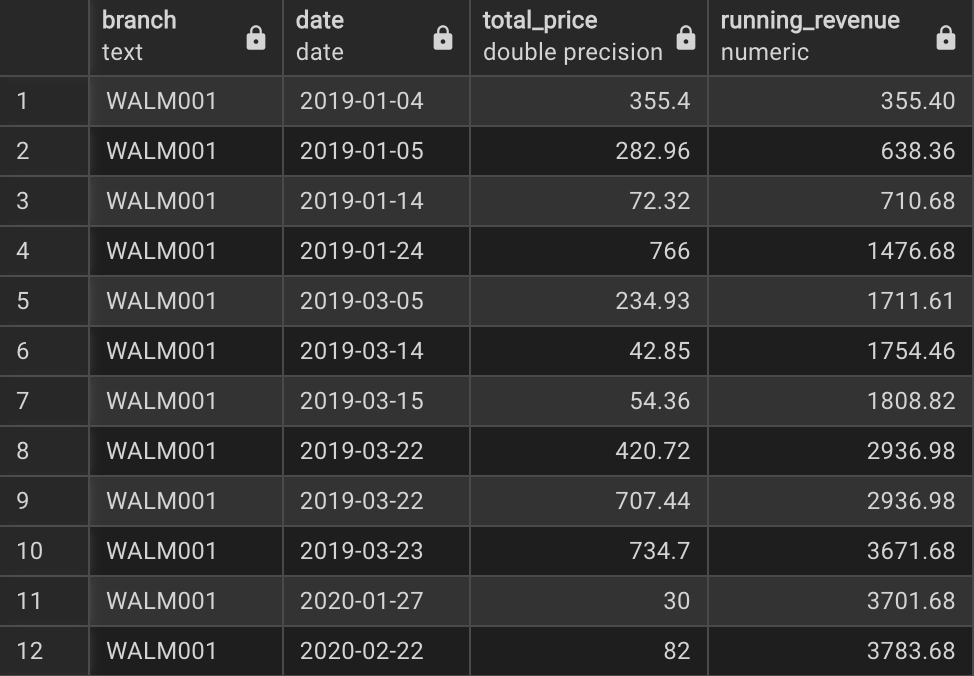

---

### **Q11. What percentage of transactions contribute to 80% of revenue (Pareto Rule)?**

```sql
WITH ranked AS (
    SELECT invoice_id, total_price,
           SUM(total_price) OVER() AS total_sales,
           SUM(total_price) OVER(ORDER BY total_price DESC) AS cumulative_sales
    FROM walmart_sales
)
SELECT ROUND(
    (COUNT(*) * 100.0 / (SELECT COUNT(*) FROM walmart_sales))::NUMERIC, 2
) AS percentage
FROM ranked
WHERE cumulative_sales * 100.0 / total_sales <= 80;
```

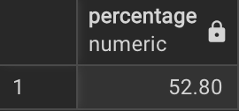

**Insight:** Approximately 52.8% of transactions contribute to 80% of total revenue, indicating that revenue generation is moderately concentrated rather than driven by a small minority of high-value transactions.

---

### **Q12. Which categories show 3 consecutive months of positive revenue growth?**

```sql
WITH monthly AS (
    SELECT category, TO_CHAR(date,'YYYY-MM') AS current_month,
           SUM(total_price) AS current_month_revenue
    FROM walmart_sales
    GROUP BY category, TO_CHAR(date,'YYYY-MM')
),
comparison AS (
    SELECT *,
           LAG(current_month_revenue) OVER(PARTITION BY category ORDER BY current_month) AS previous_month_revenue,
           LEAD(current_month_revenue) OVER(PARTITION BY category ORDER BY current_month) AS next_month_revenue
    FROM monthly
)
SELECT DISTINCT category
FROM comparison
WHERE current_month_revenue > previous_month_revenue
  AND next_month_revenue > current_month_revenue;
```

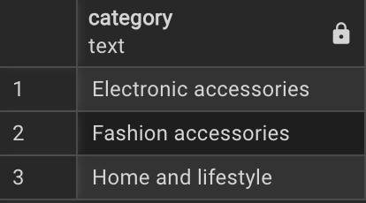

---

### **Q13. Identify category pairs frequently purchased together.**

```sql
WITH pairs AS (
SELECT a.branch, a.date, a.category AS cat1, b.category AS cat2
FROM walmart_sales a
JOIN walmart_sales b
  ON a.branch = b.branch
 AND a.date = b.date
 AND a.category < b.category
)
SELECT branch, cat1, cat2, COUNT(*) AS pair_count
FROM pairs
GROUP BY branch, cat1, cat2
ORDER BY pair_count DESC;
```


**Insight:** The frequent co-purchase of Fashion accessories and Home and lifestyle items across branches highlights a strong cross-category relationship, presenting opportunities for optimized store layout, bundled promotions, and targeted cross-selling strategies.

---

### **Q14. Build a revenue market share (%) matrix showing revenue share (%) for each (category x city) combination.**

```sql
SELECT city,
       ROUND((COALESCE(SUM(CASE WHEN category='Health and beauty' THEN total_price END),0) * 100.0 / SUM(total_price))::NUMERIC,2) AS health_and_beauty_share,
       ROUND((COALESCE(SUM(CASE WHEN category='Electronic accessories' THEN total_price END),0) * 100.0 / SUM(total_price))::NUMERIC,2) AS electronics_acc_share,
       ROUND((COALESCE(SUM(CASE WHEN category='Home and lifestyle' THEN total_price END),0) * 100.0 / SUM(total_price))::NUMERIC,2) AS home_lifestyle_share,
       ROUND((COALESCE(SUM(CASE WHEN category='Sports and travel' THEN total_price END),0) * 100.0 / SUM(total_price))::NUMERIC,2) AS sports_travel_share,
       ROUND((COALESCE(SUM(CASE WHEN category='Food and beverages' THEN total_price END),0) * 100.0 / SUM(total_price))::NUMERIC,2) AS food_beverages_share,
       ROUND((COALESCE(SUM(CASE WHEN category='Fashion accessories' THEN total_price END),0) * 100.0 / SUM(total_price))::NUMERIC,2) AS fashion_acc_share
FROM walmart_sales
GROUP BY city
ORDER BY city;
```


---

### **Q15. Correlation between average rating & quantity sold per category**

```sql
WITH monthly AS (
    SELECT category,
           TO_CHAR(date,'YYYY-MM') AS mnth,
           AVG(rating) AS avg_rating,
           SUM(quantity) AS total_quantity
    FROM walmart_sales
    GROUP BY category, TO_CHAR(date,'YYYY-MM')
)
SELECT category, CORR(avg_rating, total_quantity) AS rating_quantity_corr
FROM monthly
GROUP BY category
ORDER BY rating_quantity_corr DESC;
```


**Insight:** The relationship between customer ratings and quantity sold varies significantly across categories. While Food and beverages shows a moderate positive correlation, suggesting that higher ratings are associated with increased sales volume, most other categories exhibit weak or strongly negative correlations. This indicates that customer ratings are not a consistent driver of sales performance, and factors such as pricing, necessity, promotions, and seasonal demand likely play a more influential role in purchase decisions across several categories.

---

### **Q16. Categories consistently appearing in top 3 profit generators across all branches**

```sql
WITH ranked AS (
    SELECT branch, category,
           SUM(total_price * profit_margin) AS total_profit,
           RANK() OVER (PARTITION BY branch ORDER BY SUM(total_price * profit_margin) DESC) AS rnk
    FROM walmart_sales
    GROUP BY branch, category
)
SELECT category
FROM ranked
WHERE rnk <= 3
GROUP BY category
HAVING COUNT(*) = (SELECT COUNT(DISTINCT branch) FROM walmart_sales);
```

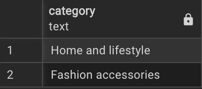

**Insight:** Home and lifestyle and Fashion accessories consistently appear among the top three profit-generating categories across all branches, indicating stable and dependable profitability regardless of location. This suggests these categories have a strong balance of pricing power and demand, making them key drivers of overall profitability and strong candidates for continued investment, prominent placement, and targeted promotions.

---

### **Q17. Determine profit outliers by applying both the Interquartile Range (IQR) method and the mean and standard deviation method. Subsequently, contrast the total number of outliers identified through each of the two analytical approaches**

### **IQR Method**

```sql
WITH stats AS (
    SELECT category,
           percentile_cont(0.25) WITHIN GROUP(ORDER BY total_price * profit_margin) AS q1,
           percentile_cont(0.75) WITHIN GROUP(ORDER BY total_price * profit_margin) AS q3
    FROM walmart_sales
    GROUP BY category
)
SELECT invoice_id, branch, city, w.category,
       total_price * profit_margin AS gross_profit,
       q1, q3, (q3 - q1) AS iqr
FROM walmart_sales w
JOIN stats s ON w.category = s.category
WHERE total_price * profit_margin < q1 - 1.5 * (q3 - q1)
   OR total_price * profit_margin > q3 + 1.5 * (q3 - q1);
```

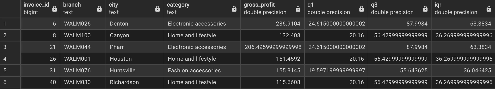

---

### **Standard Deviation Method**

```sql
WITH stats AS (
    SELECT category,
           AVG(total_price * profit_margin) AS mean_profit,
           STDDEV(total_price * profit_margin) AS std_profit
    FROM walmart_sales
    GROUP BY category
)
SELECT invoice_id, branch, city, w.category,
       total_price * profit_margin AS gross_profit,
       mean_profit, std_profit
FROM walmart_sales w
JOIN stats s ON w.category = s.category
WHERE total_price * profit_margin < mean_profit - 3 * std_profit
   OR total_price * profit_margin > mean_profit + 3 * std_profit;
```

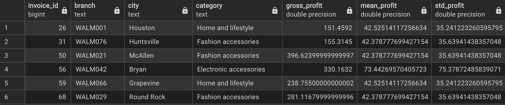

**Insight:** The number of profit outliers varies substantially depending on the detection method and threshold used. The IQR-based approach identifies a larger set of outliers (385 transactions), reflecting its sensitivity to distribution spread and robustness to skewed data. In contrast, the standard deviation method is highly dependent on the chosen threshold: using ±3 standard deviations flags significantly fewer outliers (114), while tightening the threshold to ±2 standard deviations increases detections (334), and relaxing it to ±4 standard deviations reduces detections (75). This contrast highlights how outlier identification is method- and parameter-sensitive, underscoring the importance of selecting an approach aligned with the underlying data distribution and business context.

---

## 🧾 Summary of Key Insights

- Evening hours consistently record the highest transaction volumes across branches.
- Revenue is broadly distributed, with over half of transactions contributing to 80% of total sales.
- *Fashion accessories* and *Home and lifestyle* are frequently purchased together, indicating strong cross-selling potential.
- *Home and lifestyle* and *Fashion accessories* consistently rank among the top profit-generating categories across all branches.
- Outlier detection results vary significantly by method and threshold, highlighting the need for context-aware statistical approaches. 

---

## 📁 Project Structure

```
walmart-sales-analytics/
│
├── images/
│   ├── hero_banner.png
│   ├── q1.png
│   ├── q2.png
│   ├── ...
│   ├── q17_IQR.png
│   └── q17_mean.png
│
├── Walmart.csv
├── Walmart_sales_cleaned.csv
├── Walmart_Sales_Analytics.ipynb
├── Business_problems_queries.sql
└── README.md
```

---

## ▶️ How to Run This Project

### **Install dependencies**
```bash
pip install pandas numpy sqlachemy psycopg2-binary
```

### **Download dataset via Kaggle API**
```bash
!kaggle datasets download -d najir0123/walmart-10k-sales-datasets
```

### **Run Python cleaning notebook**
- Load dataset  
- Clean and preprocess  
- Engineer new features  

### **Export cleaned DataFrame to PostgreSQL**
- Use psycopg2 or SQLAlchemy  

### **Run SQL queries in pgAdmin**
Stored in: `Business_problems_queries.sql`

---

## 🎉 Final Note

This project demonstrates:

- End-to-end ETL  
- Feature engineering  
- Advanced SQL (CTEs, window functions, correlation, ranking, outlier analytics)  
- Business insights extraction  

